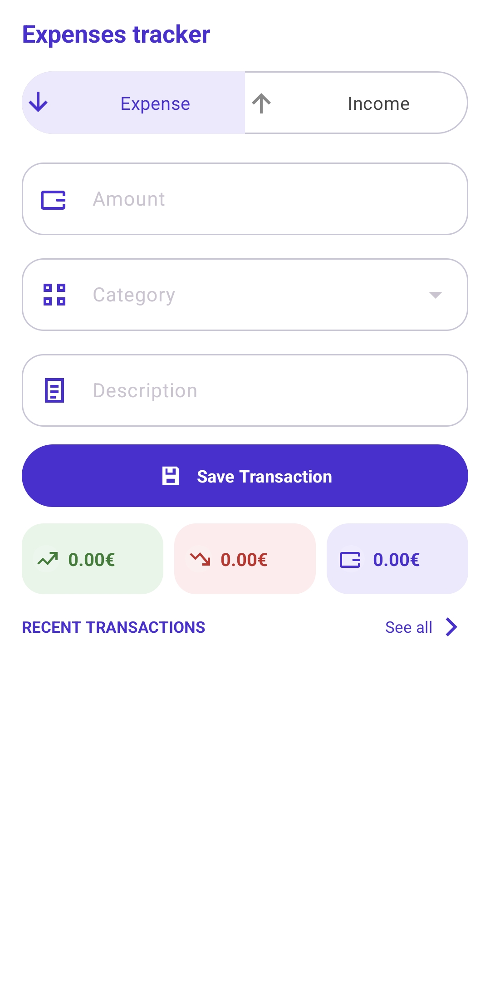
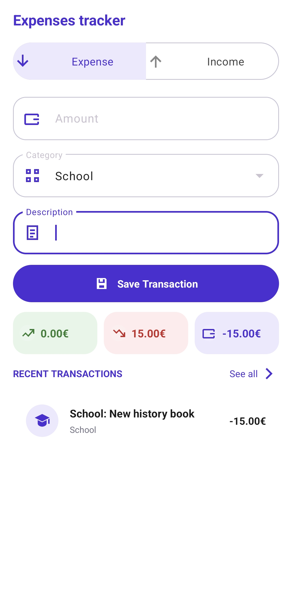
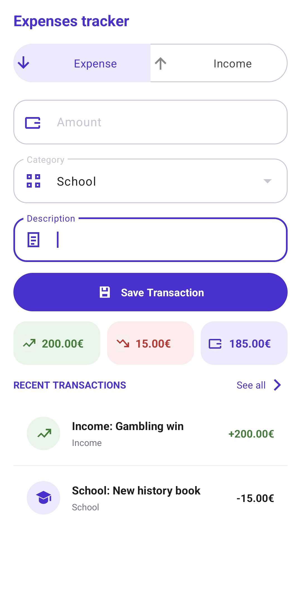
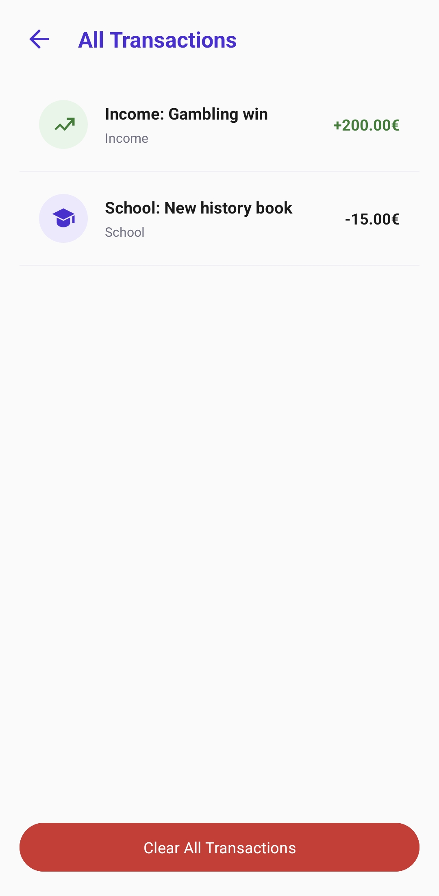
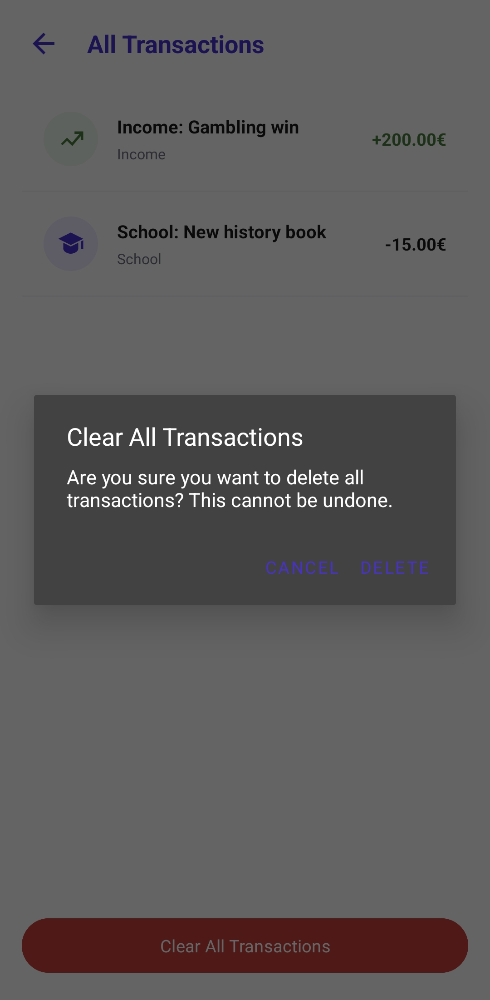

<h1 align="center">Expense Tracker</h1>

<p align="left">
A clean Android expense tracking app built with Java, Android SDK, Material Components, and local SQLite storage. The app lets the user add income and expense entries, assign spending categories, view live totals for income, expenses, and balance, browse recent transactions, open the full transaction history, and clear all saved records with confirmation.
</p>

---

### Table of Contents

- [Features](#features)
- [Screenshots](#screenshots)
- [Tech Stack](#tech-stack)
- [Project Structure](#project-structure)
- [Setup and Usage](#setup-and-usage)
- [Notes](#notes)
- [Author](#author)
- [License](#license)

---

## Features

- **Income and Expense Tracking** - Add positive income entries or categorized expense entries from the main screen.
- **Live Financial Overview** - Total income, total expenses, and current balance are recalculated after every saved transaction.
- **Category-Based Expenses** - Expense entries can be grouped by Food, Travel, Subscriptions, School, Shopping, or Other.
- **Recent Transaction Preview** - The home screen shows the five newest transactions for quick scanning.
- **Full Transaction History** - A separate history screen displays every saved transaction in newest-first order.
- **Styled Transaction Rows** - Each row uses category-aware icons, colors, labels, and signed euro amounts.
- **Local SQLite Storage** - Transactions are stored on the device in a local `ExpenseTracker.db` database.
- **Clear-All Confirmation** - The history screen includes a confirmation dialog before deleting every transaction.

---

## Screenshots



*Fresh app state with empty totals, the expense form, and no recent transactions yet.*



*Expense mode with the category selector visible for logging categorized spending.*



*Income mode with the category field hidden and the overview totals updated.*



*Full transaction history screen showing saved entries in newest-first order.*



*Confirmation dialog shown before all local transaction records are deleted.*

---

## Tech Stack

- **Java** - Activity logic, validation, adapter rendering, and database access
- **Android SDK** - Native Android screens, resources, lifecycle, and local app behavior
- **AndroidX AppCompat** - Backward-compatible activity foundation and UI support
- **Material Components** - Material buttons, cards, radio buttons, and text input layouts
- **ConstraintLayout** - Main screen and history screen layout structure
- **SQLite** - Local transaction table, totals, balance calculation, and delete-all storage flow
- **Gradle Kotlin DSL** - Android build configuration and dependency management

---

## Project Structure

```text
expense-tracker/
├── README.md
├── build.gradle.kts
├── settings.gradle.kts
├── gradle/
│   ├── libs.versions.toml                 # Dependency and plugin versions
│   └── wrapper/                           # Gradle wrapper files
├── assets/
│   ├── empty_page.jpg                     # Empty home screen screenshot
│   ├── exprense.jpg                       # Expense entry screenshot
│   ├── income.jpg                         # Income entry screenshot
│   ├── all_transactions.jpg               # Full history screenshot
│   └── clear_all_transactions.jpg         # Delete confirmation screenshot
└── app/
    ├── build.gradle.kts                   # Android app module configuration
    └── src/main/
        ├── AndroidManifest.xml
        ├── java/com/example/expensetracker/
        │   ├── MainActivity.java          # Main form, totals, recent list, and navigation
        │   ├── AllTransactionsActivity.java # Full history screen and clear-all dialog
        │   ├── DatabaseHelpers.java       # SQLite table, inserts, totals, queries, and deletes
        │   └── TransactionAdapter.java    # Category-aware transaction row rendering
        └── res/
            ├── drawable/                  # Icons, dividers, fields, buttons, and backgrounds
            ├── layout/                    # Main, history, and transaction row layouts
            ├── values/                    # Colors, strings, and themes
            └── mipmap-*/                  # Launcher icon assets
```

---

## Setup and Usage

1. **Clone the repository**
   ```bash
   git clone https://github.com/majtobijakodric/expense-tracker.git
   cd expense-tracker
   ```

2. **Open the project in Android Studio**
   - Open the cloned folder.
   - Let Android Studio finish Gradle sync.
   - Select the `app` run configuration.

3. **Run the app**
   - Start an Android emulator or connect a physical device.
   - Run the `app` module.
   - The project currently uses `minSdk 33`, so it requires Android 13 or newer.

4. **Track transactions**
   - Choose **Expense** or **Income**.
   - Enter an amount and description.
   - Select a category for expenses.
   - Save the transaction and review the updated totals.

---

## Notes

- Transactions are stored locally in SQLite and are not synced to any external account or server.
- Expense values are saved as positive numbers, then displayed with a minus sign in the transaction list.
- Income entries do not use a category; the category field is hidden when Income is selected.
- The home screen intentionally shows only the five newest transactions, while the history screen shows all saved entries.
- The clear-all action permanently deletes every transaction from the local database after the user confirms the dialog.

---

## Author

**Maj Tobija Kodrič**

---

## License

No license file is currently included in this repository.
